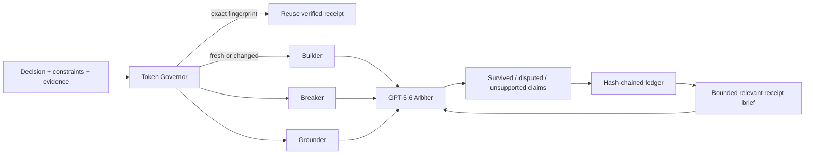

# Dissent Garden

> Keep the disagreement you cannot afford to lose.

Dissent Garden is an evidence-bound decision workspace for product and
engineering teams shipping under uncertainty. Three role-separated GPT-5.6
passes examine the same decision before an arbiter sees their work:

- **Builder** finds the strongest bounded, reversible proposal.
- **Breaker** exposes failure modes, silent assumptions, and displaced cost.
- **Grounder** audits claims against the evidence and constraints supplied.
- **Arbiter** separates claims that survived, remain disputed, or lack support.

The product does not average the seats or manufacture consensus. It preserves
the most important unresolved tension, recommends the cheapest reversible test,
and records the result in a hash-chained append-only ledger.

## Why it exists

Most AI decision tools return one persuasive answer. That can hide minority
risks, unsupported claims, and the reasons a decision changed later. Dissent
Garden makes those boundaries visible:

1. Role-separated seats reason in isolation before adjudication.
2. Model-supplied evidence IDs are validated by the server.
3. Unsupported claims cannot be silently promoted as survivors.
4. Corrections append to history rather than rewriting it.
5. A Token Governor prevents the ledger itself from becoming context bloat.

## Token Governor

The receipt-aware Governor is part of the product, not a future optimization.

- Exact repeats of a live, verified, correction-free decision reuse its receipt
  with **zero new GPT-5.6 calls**. The displayed saving comes from the original
  receipt's actual recorded usage.
- A later correction invalidates exact reuse and enters the next bounded memory
  brief, so updated evidence cannot silently return a stale verdict.
- Near-relevant prior decisions are ranked lexically and condensed into a brief
  capped at 1,800 characters.
- Old conclusions are explicitly not treated as new evidence.
- The arbiter is told to foreground changed evidence, new dissent, or a truly
  different next test.
- BUILD, AUDIT, DWELL, and SHED modes progressively reduce output ceilings as
  the configurable daily budget fills.
- Actual input/output usage and actual model tokens avoided by receipt reuse are
  written to a separate local Governor state file and displayed in the
  interface. Hypothetical context reduction is labeled separately as estimated.
- Curated showcase records never enter live model memory or satisfy live cache
  reuse.

This is bounded, auditable compression—not an ever-growing hidden summary.

## Quick start

Requires Python 3.11+.

```powershell
python -m pip install -r requirements.txt
.\run.ps1
```

If `OPENAI_API_KEY` is not already set, the launcher asks you to copy the key to
the clipboard and press Enter. It validates the key shape, transfers the key
only to the server process, and immediately clears the clipboard. The key is not
written to disk. You may alternatively set `$env:OPENAI_API_KEY` in the same
PowerShell session before launching. On
its first run, the launcher creates an ignored project-local `.venv` and installs
the pinned dependency ranges there, preventing conflicts between system Python
installations.

Open [http://127.0.0.1:8765](http://127.0.0.1:8765).

On Windows you can also double-click `run.bat`. The interface remains usable
without an API key through the clearly labeled **Watch showcase** path. Showcase
mode demonstrates the complete UI with a curated dataset; it never claims to be
a live model response.

### Configuration

| Environment variable | Default | Purpose |
| --- | --- | --- |
| `OPENAI_API_KEY` | none | Enables live deliberation |
| `DISSENT_GARDEN_MODEL` | `gpt-5.6` | Runtime model; keep GPT-5.6 for Build Week |
| `DISSENT_GARDEN_DAILY_TOKEN_BUDGET` | `100000` | Local Governor threshold |
| `DISSENT_GARDEN_API_TIMEOUT_SECONDS` | `90` | Timeout applied by the OpenAI client |
| `DISSENT_GARDEN_API_MAX_RETRIES` | `2` | SDK retries for transient failures |

## Architecture



The three role-separated passes run concurrently through the OpenAI Responses API. Each returns
strict structured output. The arbiter receives their completed isolated
passes and, when relevant, a small receipt brief produced deterministically by
the Governor. Server-side validation removes invented evidence IDs and demotes
evidence-free survivors to unsupported.

## API routes

| Route | Purpose |
| --- | --- |
| `GET /api/health` | Runtime, model, ledger, and Governor status |
| `GET /api/sample` | Editable demonstration request |
| `POST /api/showcase` | Clearly labeled curated UI showcase |
| `POST /api/deliberate` | Live four-pass GPT-5.6 deliberation |
| `GET /api/ledger` | Verified append-only decision history |
| `GET /api/governor` | Token budget, usage, savings, and recent events |
| `POST /api/decisions/{id}/corrections` | Append a correction without erasing history |

## Verification

```powershell
python -m pytest -q
python -m compileall -q app tests
node --check app\static\app.js
```

The tests cover the front door, showcase contract, missing-key boundary,
evidence-ID validation, hash-chain tamper detection, correction-aware live-only
receipt reuse, canonical fingerprints, bounded memory compaction, Governor
accounting, and orphan-correction rejection.

## OpenAI Build Week disclosure

This repository and implementation were created on **July 17, 2026**, during
the OpenAI Build Week submission period. The conceptual roots—role-separated
personas, preserved disagreement, append-only ledgers, and token governance—were
developed earlier in the creator's private research corpus. No pre-existing
application code was copied into this repository. The Build Week project is the
new product design, GPT-5.6 orchestration, receipt-aware Governor, web interface,
testing, and submission package contained here.

### How Codex was used

Codex was the primary development environment for:

- product framing and contest-rule analysis;
- architecture and data-contract design;
- GPT-5.6 Responses API integration;
- backend, UI, ledger, and Token Governor implementation;
- automated tests and live browser verification;
- responsive design review and submission documentation.

The `/feedback` session ID from this primary build task will be added to the
Devpost submission.

### How GPT-5.6 is used in the product

GPT-5.6 performs the product's core work at runtime. Three role-separated calls
produce evidence-cited seat passes before seeing one another. A fourth call adjudicates their atomic
claims and creates the surviving core, unresolved tension, next test, and
decision. Removing GPT-5.6 would remove the deliberation product itself; its use
is neither incidental nor decorative.

## Data and safety boundaries

- API keys are read only from the environment and are never stored.
- Decision records remain local as JSONL unless the operator deploys the app.
- Evidence is supplied by the user; Dissent Garden does not claim to fact-check
  the external world.
- The claim-survival rate reports the share of adjudicated claims that survived;
  it is not a confidence or truth score.
- The hash chain is tamper-evident, not tamper-proof against a privileged local
  attacker who can replace the complete ledger.
- The current JSONL build is a single-user contest prototype. Public deployments
  should contain demonstration data only until authentication and tenant
  isolation are added.
- Dissent Garden is a decision aid, not medical, legal, or financial advice.

## License

MIT — see `LICENSE`.
